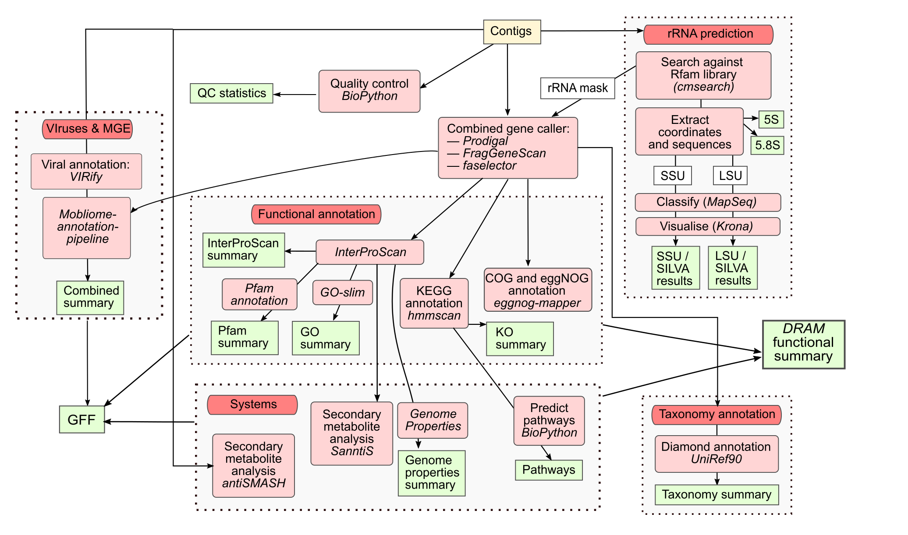

# ebi-metagenomics/assembly-analysis-pipeline

[](https://github.com/ebi-metagenomics/assembly-analysis-pipeline/actions/workflows/ci.yml)
[](https://github.com/ebi-metagenomics/assembly-analysis-pipeline/actions/workflows/linting.yml)
[](https://www.nf-test.com)
[](https://www.nextflow.io/)

## Introduction

# MGnify assembly analysis pipeline

This repository contains the [MGnify](https://www.ebi.ac.uk/metagenomics) assembly analysis pipeline, from version 6.0.0 onwards. For version 5.0 of the pipeline, please [follow this link](https://github.com/EBI-Metagenomics/pipeline-v5).



## Pipeline description

### Features

The MGnify assembly analysis pipeline, version 6.0.0 and onwards, provides the following key features:

- Assembly Quality Control: The pipeline performs quality control on the assembled contigs, with plans to add decontamination functionality in the near future.
- CDS Prediction: The pipeline utilizes the [MGnify Combined Gene Caller](link_to_combined_gene_caller) to predict coding sequences (CDS) within the assembled contigs.
- Taxonomic Assignment: The pipeline assigns taxonomic classifications to the assembled contigs using [Contig Annotation Tool (CAT)](https://github.com/MGXlab/CAT_pack).
- Functional Annotation:
  - [InterProScan](https://www.ebi.ac.uk/interpro/interproscan.html): Identifies protein domains, families, and functional sites.
  - [eggNOG Mapper](https://eggnog-mapper.embl.de/): Assigns clusters of orthologs groups (COGs) annotations and eggNOG functional descriptions.
  - [GO Slims](http://www.geneontology.org/ontology/subsets/goslim_metagenomics.obo): The pipeline maps the protein sequences to Gene Ontology (GO) Slim terms.
  - [run_dbCAN](https://github.com/bcb-unl/run_dbcan): Annotates carbohydrate-active enzymes.
  - [KEGG Orthologs](https://www.genome.jp/kegg/ko.html): Assigns KEGG Orthologs (KO) identifiers using HMMER.
  - [RHEA](https://www.rhea-db.org/): Proteins are assigned RHEA ids.
- Biosynthetic Gene Cluster Annotation: The pipeline uses [antiSMASH](https://antismash.secondarymetabolites.org/) and [SanntiS](https://github.com/Finn-Lab/SanntiS) to identify and annotate biosynthetic gene clusters associated with secondary metabolite production.
- KEGG Modules completeness: The pipeline analyzes the KEGG Orthologs annotations to infer the presence and completeness of KEGG modules.
- Consolidated annotation: The pipeline aggregates all the generated annotations into a single consolidated GFF file.

### Tools

| Tool                                                                                              | Version              | Purpose                                                                                                                                           |
| ------------------------------------------------------------------------------------------------- | -------------------- | ------------------------------------------------------------------------------------------------------------------------------------------------- |
| [antiSMASH](https://antismash.secondarymetabolites.org/#!/start)                                  | 8.0.1                | Tool for the identification and annotation of secondary metabolite biosynthesis gene clusters                                                     |
| [CAT_pack](https://github.com/MGXlab/CAT_pack)                                                    | 6.0                  | Taxonomic classification of the contigs in the assembly                                                                                           |
| [cmsearchtbloutdeoverlap](https://github.com/nawrockie/cmsearch_tblout_deoverlap/)                | 0.09                 | Deoverlapping of cmsearch results                                                                                                                 |
| [csvtk](http://bioinf.shenwei.me/csvtk)                                                           | 0.31.0               | A cross-platform, efficient, and practical CSV/TSV toolkit                                                                                        |
| [Combined Gene Caller - Merge](https://www.ebi.ac.uk/metagenomics)                                | 1.2.0                | Combined gene caller merge script used to combine predictions of Pyrodigal and FragGeneScanRS (this tool is part of the mgnify-pipelines-toolkit) |
| [Diamond](https://github.com/bbuchfink/diamond)                                                   | 2.1.11               | Used to match predicted CDS against the CAT reference database for the taxonomic classification of the contigs                                    |
| [DRAM](https://github.com/WrightonLabCSU/DRAM)                                                    | 13.5                 | Summarizes annotations from multiple tools like KEGG, Pfam, and CAZy                                                                              |
| [easel](https://github.com/EddyRivasLab/easel)                                                    | 0.49                 | Extracts FASTA sequences by name from a cmsearch deoverlap result                                                                                 |
| [extractcoords](https://github.com/EBI-Metagenomics/mgnify-pipelines-toolkit)                     | 1.2.0                | Processes output from easel-sfetch to extract SSU and LSU sequences (this tool is part of the mgnify-pipelines-toolkit).                          |
| [FragGeneScanRs](https://github.com/unipept/FragGeneScanRs)                                       | 1.1.0                | CDS calling; this tool specializes in calling fragmented CDS                                                                                      |
| [generategaf](https://github.com/EBI-Metagenomics/mgnify-pipelines-toolkit)                       | 1.2.0                | Script that generates a GO Annotation File (GAF) from an InterProScan result TSV file (this tool is part of the mgnify-pipelines-toolkit).        |
| [Genome Properties](https://www.ebi.ac.uk/interpro/genomeproperties/)                             | 2.0                  | Uses protein signatures as evidence to determine the presence of each step within a property                                                      |
| [Infernal - cmscan](http://eddylab.org/infernal/)                                                 | 1.1.5                | RNA sequence searching                                                                                                                            |
| [InterProScan](https://www.ebi.ac.uk/interpro/download/InterProScan/)                             | 5.73-104.0           | Functionally characterizes nucleotide or protein sequences by scanning them against the InterPro database.                                        |
| [HMMER](http://hmmer.org/)                                                                        | 3.4                  | Used to annotate CDS with KO                                                                                                                      |
| [Krona](https://github.com/marbl/Krona/wiki/KronaTools)                                           | 2.8.1                | Krona chart visualization                                                                                                                         |
| [kegg-pathways-completeness](https://github.com/EBI-Metagenomics/kegg-pathways-completeness-tool) | 1.3.0                | Computes the completeness of each KEGG pathway module based on KEGG orthologue (KO) annotations.                                                  |
| [MGnify pipelines toolkit](https://github.com/EBI-Metagenomics/mgnify-pipelines-toolkit)          | 1.2.0                | Collection of tools and scripts used in MGnify pipelines.                                                                                         |
| [MultiQC](http://multiqc.info/)                                                                   | 1.29                 | Tool to aggregate bioinformatic analysis results.                                                                                                 |
| [Owltools](https://github.com/owlcollab/owltools)                                                 | 2024-06-12T00:00:00Z | Tool utilized to map GO terms to GO-slims                                                                                                         |
| [Pyrodigal](https://pyrodigal.readthedocs.org/)                                                   | 3.6.3                | CDS calling                                                                                                                                       |
| [pigz](https://zlib.net/pigz/)                                                                    | 2.3.4                | A parallel implementation of gzip for modern multi-processor, multi-core systems                                                                  |
| [QUAST](http://quast.sourceforge.net/quast)                                                       | 5.2.0                | Tool used evaluates genome assemblies, it's part of the pipeline QC module.                                                                       |
| [run_dbCAN](https://github.com/bcb-unl/run_dbcan)                                                 | 5.1.2                | Annotation tool for the Carbohydrate-Active enZYmes Database (CAZy)                                                                               |
| [SeqKit](https://bioinf.shenwei.me/seqkit/)                                                       | 2.8.0                | Used to manipulate FASTA files                                                                                                                    |
| [SanntiS](https://github.com/Finn-Lab/SanntiS)                                                    | 0.9.4.1              | Tool used to identify biosynthetic gene clusters                                                                                                  |
| [tabix](http://www.htslib.org/doc/tabix.html)                                                     | 1.21                 | Generic indexer for TAB-delimited genome position files                                                                                           |
| [Genome Tools - gff3validator](https://genometools.org/tools/gt_gff3validator.html)               | 1.6.5                | Used to validate the analysis summary GFF file                                                                                                    |
| [jq](https://github.com/jqlang/jq)                                                                | 1.5                  | Used to concatenate the chunked antiSMASH json results                                                                                            |

### Reference databases

This pipeline uses several reference databases, you can find the list of them in the follow table. The databases marked with <sup>\*</sup> are downloaded and post-processed by the [Microbiome Informatics reference-databases-preprocessing-pipeline](https://github.com/EBI-Metagenomics/reference-databases-preprocessing-pipeline). Our team also stores ready to use version of these databases in EBI's FTP server.

| Reference database                                                                                           | Version    | Purpose                                                                                          | Download                                                                                                                                                                                                               |
| ------------------------------------------------------------------------------------------------------------ | ---------- | ------------------------------------------------------------------------------------------------ | ---------------------------------------------------------------------------------------------------------------------------------------------------------------------------------------------------------------------- |
| [Rfam covariance models](https://rfam.org/)                                                                  | 15         | rRNA covariance models                                                                           | [ftp://ftp.ebi.ac.uk/pub/databases/Rfam/15.0/Rfam.cm.gz ](https://ftp.ebi.ac.uk/pub/databases/Rfam/15.0/Rfam.cm.gz)                                                                                                    |
| [Rfam clan info](https://rfam.org/)                                                                          | 15         | rRNA clan information                                                                            | [ftp://ftp.ebi.ac.uk/pub/databases/Rfam/15.0/Rfam.clanin](https://ftp.ebi.ac.uk/pub/databases/Rfam/15.0/Rfam.clanin)                                                                                                   |
| [InterProScan](https://www.ebi.ac.uk/interpro/download/InterProScan/)                                        | 5.73-104.0 | InterProScan reference database                                                                  | [ftp://ftp.ebi.ac.uk/pub/software/unix/iprscan/5/5.73-104.0/](httpd://ftp.ebi.ac.uk/pub/software/unix/iprscan/5/5.73-104.0/)                                                                                           |
| [eggNOG-mapper](https://github.com/eggnogdb/eggnog-mapper/wiki/eggNOG-mapper-v2.1.5-to-v2.1.12#requirements) | 5.0.2      | eggNOG-mapper annotation databases and Diamond                                                   | https://github.com/eggnogdb/eggnog-mapper/wiki/eggNOG-mapper-v2.1.5-to-v2.1.12#requirements                                                                                                                            |
| [antiSMASH](https://rfam.org/)                                                                               | 8.0.1      | The antiSMASH reference database                                                                 | https://docs.antismash.secondarymetabolites.org/install/#antismash-standalone-lite                                                                                                                                     |
| [KOFAM](https://www.genome.jp/tools/kofamkoala/)<sup>\*</sup>                                                | 2025-04    | KOfam - HMM profiles for KEGG/KO. Our reference generation pipeline generates the required files | https://github.com/EBI-Metagenomics/reference-databases-preprocessing-pipeline                                                                                                                                         |
| [GO Slims](https://geneontology.org/docs/go-subset-guide/)<sup>\*</sup>                                      | 20160705   | Metagenomics GO Slims                                                                            | [ftp://ftp.ebi.ac.uk/pub/databases/metagenomics/pipelines/tool-dbs/goslim/20160705/goslim_20160705.tar.gz](https://ftp.ebi.ac.uk/pub/databases/metagenomics/pipelines/tool-dbs/goslim/20160705/goslim_20160705.tar.gz) |
| [run_dbCAN](https://dbcan.readthedocs.io/en/latest/installation.html#build-database)                         | 4.1.4-V13  | Pre-built run_DBCan reference database                                                           | [ftp://ftp.ebi.ac.uk/pub/databases/metagenomics/pipelines/tool-dbs/dbcan/dbcan_4.1.3_V12.tar.gz](http://ftp.ebi.ac.uk/pub/databases/metagenomics/pipelines/tool-dbs/dbcan/dbcan_4.1.3_V12.tar.gz)                      |
| [CAT_Pack](https://github.com/MGXlab/CAT_pack)                                                               | 2025_01    | CAT/BAT/RAT NCBI taxonomy pre-made reference database                                            | https://github.com/MGXlab/CAT_pack?tab=readme-ov-file#downloading-preconstructed-database-files                                                                                                                        |
| [DRAM](https://github.com/WrightonLabCSU/DRAM)                                                               | 1.3.0      | DRAM databases                                                                                   | https://github.com/WrightonLabCSU/DRAM/wiki#dram-setup                                                                                                                                                                 |

## How to run

### Requirements

At the moment the only prerequisites for running it are Nextflow and [Docker](https://www.docker.com/)/[Singularity](https://docs.sylabs.io/guides/3.5/user-guide/introduction.html), since all the Nextflow processes use pre-built containers.

### Input shape

The input data for the pipeline is metagenomic assemblies FASTA files. These files should be specified using a `.csv` samplesheet file with this format:

```
sample,assembly_fasta
ERZ999,/path/to/assembly/ERZ999.fasta.gz
ERZ998,/path/to/assembly/ERZ998.fasta.gz
```

### Execution

You can run the current version of the pipeline with:

```bash
nextflow run ebi-metagenomics/assembly-analysis-pipeline \
    -r main \
    --input /path/to/samplesheet.csv \
    --outdir /path/to/outputdir
```

This pipeline supports [nf-core shared configuration files](https://nf-co.re/docs/usage/getting_started/configuration#shared-nf-coreconfigs).

For a more detailed description on how to use the pipeline, see the [usage](docs/usage.md) file.

## Outputs

For a more detailed description of the different output files, see the [outputs](docs/output.md) file.

## Citations

> Richardson L, Allen B, Baldi G, Beracochea M, Bileschi ML, Burdett T, et al. MGnify: the microbiome sequence data analysis resource in 2023 [Internet]. Vol. 51, Nucleic Acids Research. Oxford University Press (OUP); 2022. p. D753–9. Available from: http://dx.doi.org/10.1093/nar/gkac1080

An extensive list of references for the tools used by the pipeline can be found in the [`CITATIONS.md`](CITATIONS.md) file.

This pipeline uses code and infrastructure developed and maintained by the [nf-core](https://nf-co.re) community, reused here under the [MIT license](https://github.com/nf-core/tools/blob/main/LICENSE).

> **The nf-core framework for community-curated bioinformatics pipelines.**
>
> Philip Ewels, Alexander Peltzer, Sven Fillinger, Harshil Patel, Johannes Alneberg, Andreas Wilm, Maxime Ulysse Garcia, Paolo Di Tommaso & Sven Nahnsen.
>
> _Nat Biotechnol._ 2020 Feb 13. doi: [10.1038/s41587-020-0439-x](https://dx.doi.org/10.1038/s41587-020-0439-x).
